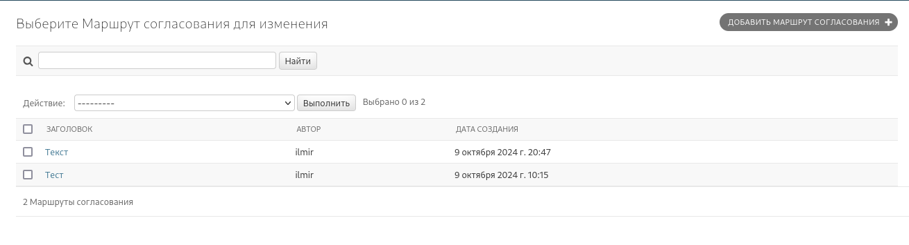
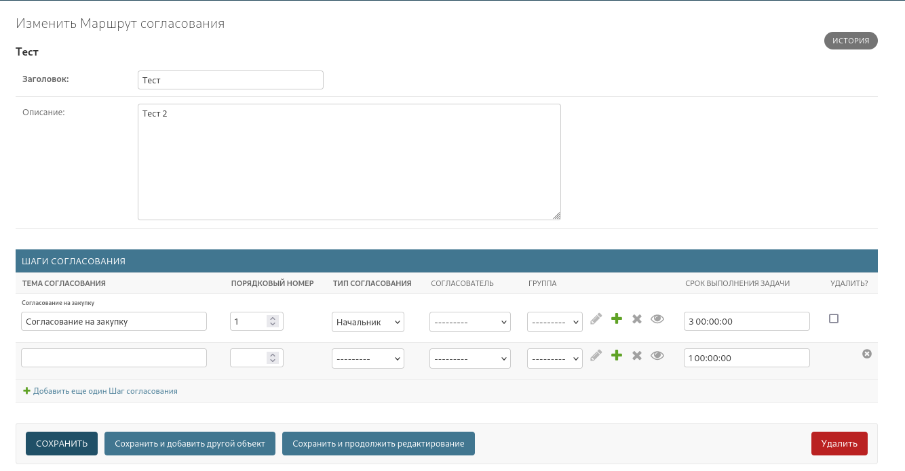
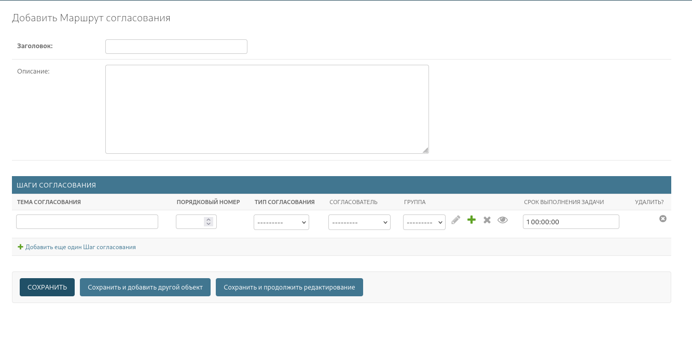

# ApproveRoute - Маршрут согласования
## Цель
Маршрут согласования необходимо для организации согласования для исполнения заявки
Состоит из [шагов согласования](./ApproveStep.md)

## Поля

| Название    | Тип               | Описание          | Обязательность    |
|-------------|-------------------|-------------------|-------------------|
| title       | CharField         | Название маршрута | Обязательное поле |
| description | TextField         | Описание маршрута | -                 |
| steps       | List[ApproveStep] | Шаги согласования |                   |
| author      | ForeignKey        | Автор маршрута    | Обязательное поле |
| created_at  | DateTimeField     | Дата создания     | Обязательное поле |
| updated_at  | DateTimeField     | Дата обновления   | Обязательное поле |

## Доступы

| Доступ                      | Описание                                  |
|-----------------------------|-------------------------------------------|
| tasker.add_approvalroute    | Пользователь может создавать маршруты     |
| tasker.view_approvalroute   | Пользователь может просматривать маршруты |
| tasker.change_approvalroute | Пользователь может редактировать маршруты |
| tasker.delete_approvalroute | Пользователь может удалять маршруты       |
| tasker.add_approvestep      | Пользователь может создавать маршруты     |
| tasker.view_approvestep     | Пользователь может просматривать маршруты |
| tasker.change_approvestep   | Пользователь может редактировать маршруты |
| tasker.delete_approvestep   | Пользователь может удалять маршруты       |
Для работы в Админ панели Учетную запись пользователя должна быт Staff

## Просмотр в Админ панели
### Просмотр списка маршрутов согласования
Для этого перейдите в /admin/tasker/approvalroute/

### Для просмотра Конкретного маршрута согласования выберите 1 из маршрутов

В Зависимости от Доступа кнопки могут различаться для просмотра и редактирования
### Для создание маршрута согласования 
перейдите в /admin/tasker/approvalroute/add/

Автор будет автоматически присвоен. Указывать шаги надо именно на этом этапе

## Работа с API
Актуальные инструкции по использованию API смотрите в /api/docs/
Ниже приведен пример запроса
### Получение списка маршрутов согласования
`GET /api/v1/tasker/approval_route/`

Вы получите список маршрутов согласования следующего вида 
```json
[
  {
    "title":"Тест",
    "description":"Тест 2",
    "author":2,
    "steps":[
      {
        "title":"Согласование на закупку",
        "approval_type":"manager",
        "specific_approver":null,
        "group_approver":null,
        "dedlin":"3 00:00:00"
      }
    ]
  },
  {
    "title":"Текст",
    "description":"Описание",
    "author":2,
    "steps":[
      {
        "title":"ШагСогласование",
        "approval_type":"manager",
        "specific_approver":null,
        "group_approver":null,
        "dedlin":"1 00:00:00"
      },
      {
        "title":"Шаг2Согласование",
        "approval_type":"specific",
        "specific_approver":4,
        "group_approver":null,
        "dedlin":"2 00:00:00"
      }
    ]
  }
]
```
