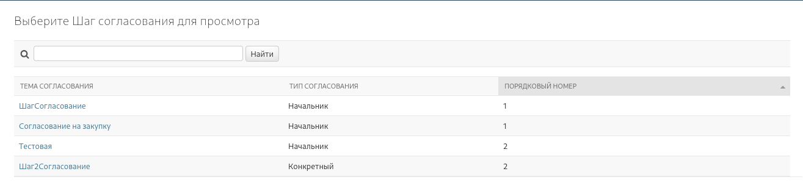

# ApproveStep - Шаг согласования
Шаг согласования описывает как необходимо согласовать, время для согласования
## Цель
Маршрут согласования необходимо для организации согласования для исполнения заявки
Состоит из [шагов согласования](./ApproveStep.md)

## Поля

| Название          | Тип        | Описание             | Обязательность    |
|-------------------|------------|----------------------|-------------------|
| title             | CharField  | Название Согл.       | Обязательное поле |
| route             | ForeignKey | Маршрут согласования | Обязательное поле |
| order_number      | Integer    | Порядок Согл.        | Обязательное поле |
| approval_type     | Choice     | Тип                  | Обязательное поле |
| specific_approver | ForeignKey | Согласователь        | -                 |
| group_approver    | ForeignKey | Группа               | -                 |
| dedlin            | Duration   | Срок выполнения      | Обязательное поле |

## Доступы

| Доступ                     | Описание                                  |
|----------------------------|-------------------------------------------|
| tasker.add_approvestep     | Пользователь может создавать маршруты     |
| tasker.view_approvestep    | Пользователь может просматривать маршруты |
| tasker.change_approvestep  | Пользователь может редактировать маршруты |
| tasker.delete_approvestep  | Пользователь может удалять маршруты       |

Для работы в Админ панели Учетную запись пользователя должна быт Staff

## Админ панель
В Админ панели можно смотреть шаги согласования

Также вы можете просмотреть конкретный шаг согласования

Шаг может быть создан только в [маршруте согласования](./ApprovalRoute.md). Другим способом в админ панели редактировать нельзя.
Это сделано для того, чтобы не допускать изменения внешних ключей.

При создании необходимо выбрать тип согласование. 

* `specific` - конкретный согласователь. Вам необходимо указать конкретного согласователя в поле `specific_approver`. Если не указана будет ошибка 400
* `group` - группа. Вам необходимо указать группу в поле `group_approver`. Если не указана будет ошибка 400
* `manager` - начальник.
