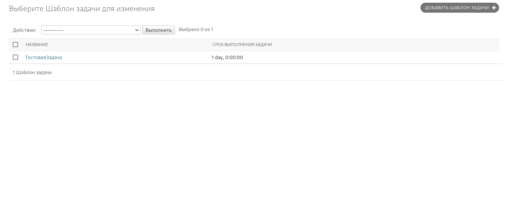
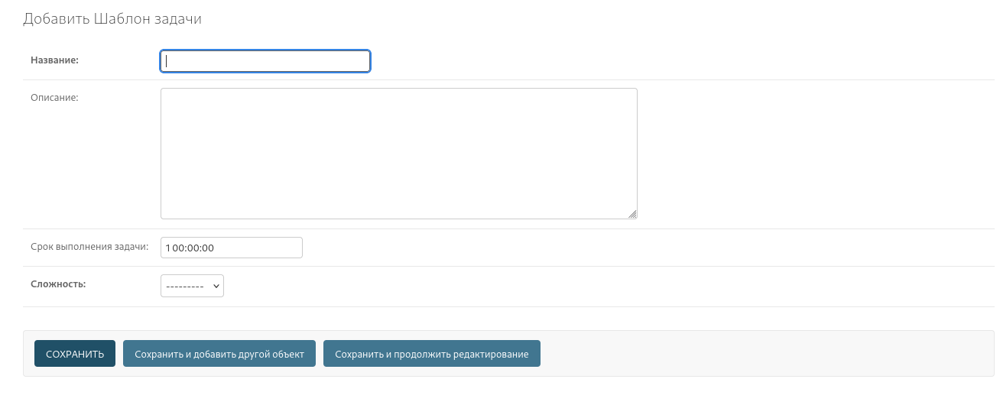
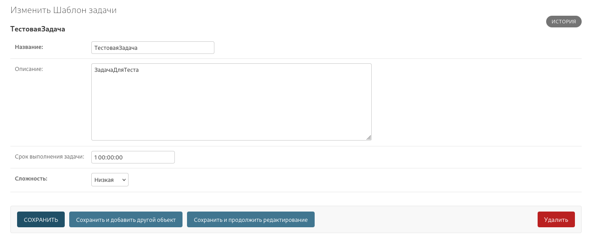

# TaskTemplate - шаблон задания
[Перейти к оглавлению](./Сontents.md)
## Цель
Служит шаблоном для заданий. На их основании формируются задания. 
Создают и редактируют их только люди имеющие права(соответствующие доступы).

## Поля

| Название    | Тип       | Описание         | Обязательность    |
|-------------|-----------|------------------|-------------------|
| title       | CharField | Название шаблона | Обязательное поле |
| description | CharField | Описание шаблона | -                 |
| dedline     | Duration  | Время выполнения | Обязательное поле |
| complexity  | Сhoice    | Сложность        | Обязательное поле |

## Доступы

| Доступ                     | Описание                                   |
|----------------------------|--------------------------------------------|
| tasker.add_tasktemplate    | Пользователь может создавать шаблоны       |
| tasker.view_tasktemplate   | Пользователь может просматривать шаблоны   |
| tasker.change_tasktemplate | Пользователь может редактировать шаблоны   |
| tasker.delete_tasktemplate | Пользователь может удалять шаблоны         |

## Работа с данными
Создаются отдельно в Админ панели. 
Для работы в Админ панели Учетную запись пользователя должна быт Staff и иметь права на создание шаблонов заданий.
### Для просмотра шаблонов заданий
Перейдите /admin/tasker/tasktemplate/

Тут вы можете просмотреть все шаблоны заданий. Или создать собственный шаблон задания

Также вы можете просмотреть конкретный шаблон задания нажав на название шаблона

Вы там можете редактировать шаблон задания.

***Лучше всего создавать шаблоны заданий только в [шаблоне заявок](./RequestTemplate.md)***